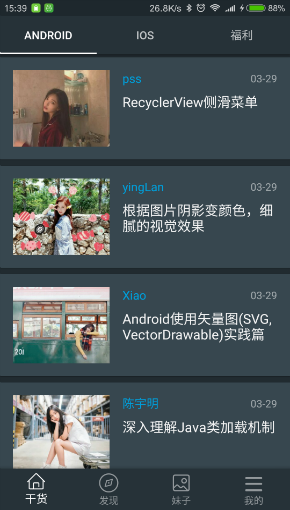
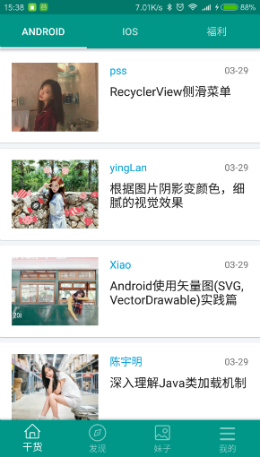
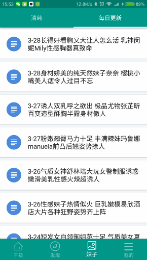

# Gank

### 前言

应用含有知识干货、新鲜事、妹子、科技资讯，搞笑视频和图片，动态更新皮肤等，图片来源于<a href="http://www.mzitu.com/">妹子图</a>，图标来源于<a href="http://iconfont.cn/">阿里巴巴矢量图</a>，项目采用 mvp-clean 架构，基于 Glide + retrofit2 + rxjava2 + Rxbus + butterknife。

### 安装包 
<a href="https://pro-app-qn.fir.im/39d225b22b239c79c88751f3297ec7f4a6057a5c.apk?attname=gankly_2.1.1_8.24.apk_2.1.1.apk&e=1503562220&token=LOvmia8oXF4xnLh0IdH05XMYpH6ENHNpARlmPc-T:kJonnEV5WckLuOeJuA4TACw5U2M=">下载最新apk</a>

### 应用截图

 

### Gif

### 技术、第三方库
* MVP（MVP 模式）
* Retrofit2（Retrofit 网络请求的框架）
* RxJava2（RxJava 响应式编程框架）
* GreenDao（移动数据库）
* ButterKnife（依赖注入绑定视图）
* Glide（图片加载库）
* Jsoup（Java 的HTML解析器）
* Bugly（腾讯异常收集工具）
* Klog（Log日志调试）
* Recyclerview-animators（Recyclerview 动画）
* Stetho （查看数据库 请求连接等，Fackbook 出品）
* Superplayerlibrary （视频播放库）
* Bottom-bar （底部导航栏）
* Okhttp3 （网络请求库）

### 联系方式
137387869@qq.com

### 历史更新
#### V2.1.1
* 修复 妹子图防盗链问题
* 优化 使用Glide 4.0版本
* 优化 查看图片显示方式，更加平滑
* 优化 查看图片开启自动滑动模式
* 优化 查看图片选择页数
* 优化 在5.0上点击显示效果
* 优化 查看妹子（清纯、治愈系）访问速度提高
* 新增 图片可以设置为桌面背景
* 新增 可设置仅在wifi下加载图片功能
* 新增 清除图片缓存

#### V2.1
* 新增 团队博客
* 新增 科技资讯
* 新增 更多（不得姐）
* 新增 我的收藏
* 新增 关于
* 优化 煎蛋杂集 更名 新鲜事

#### V2.0
* 新增 夜间模式
* 新增 煎蛋杂集
* 优化 侧滑栏UI
* 优化 Android 界面布局
* 优化 福利 滑动效果
* 修改 欢迎页界面
* 修复 一些已知问题

#### V1.0
* Gank （Android、ios、福利）内容的浏览
* 娱乐休息视频
* 程序员大（ni）福（dong）利（de） 美しい妹
* 收藏
* 关于

### 感谢
* @代码家 提供接口
* 瓶子同学的友情帮助
* 远耕同学的友情帮助
* Google

### 声明
    Copyright 2016 LeftCoding

    Licensed under the Apache License, Version 2.0 （the "License"）;
    you may not use this file except in compliance with the License.
    You may obtain a copy of the License at

     http://www.apache.org/licenses/LICENSE-2.0

    Unless required by applicable law or agreed to in writing, software
    distributed under the License is distributed on an "AS IS" BASIS,
    WITHOUT WARRANTIES OR CONDITIONS OF ANY KIND, either express or implied.
    See the License for the specific language governing permissions and
    limitations under the License.
